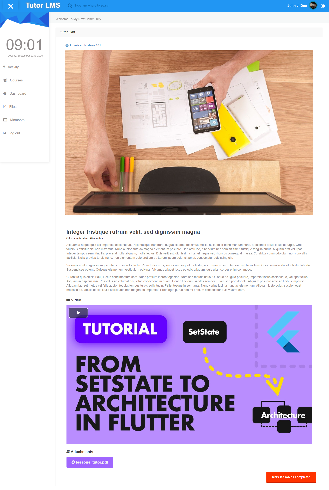

# Lessons plugin for Elgg Tutor LMS

This plugin lets you create lessons under course and attach video and other attachments to each lesson. 
Create unlimited lessons using the intuitive elgg user interface with all required options to offer a top-notch e-learning experience.

## Getting Started

- Download or clone this repository/plugin
- Unzip it inside the mod folder
- Go to the plugins section, and activate it

## Features

- Outstanding design compatible with any theme
- Unlimited lessons
- Add YouTube/Vimeo videos
- Attach documents such as: Reading material, instructions, brochures, etc.
- Let users mark lessons as completed
- Compatible with Tutor LMS plugin

## To do

- View users that completed the lesson
- Show users time/date lesson was completed
- Add a "Go to next lesson" feature

